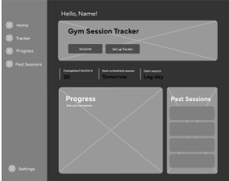
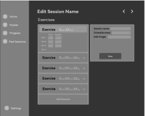
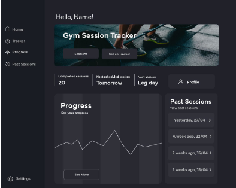
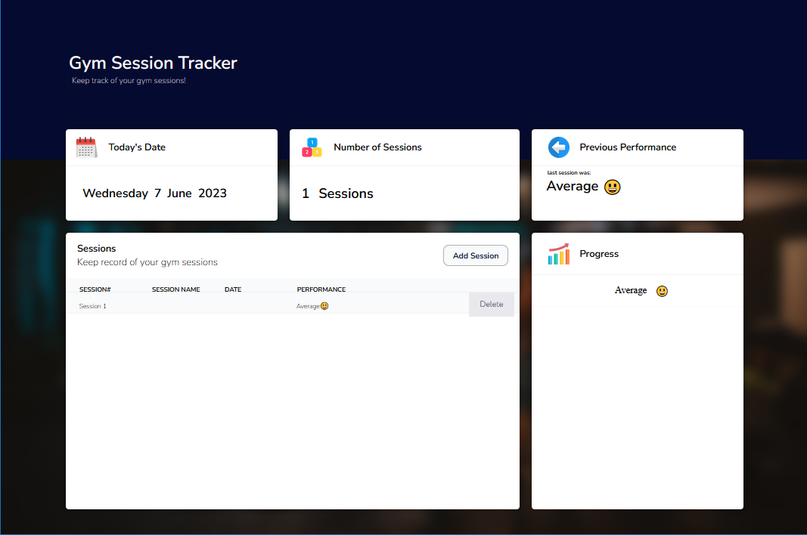

# Web Application Development Documentation

# Development Process

## First Iteration: Mid-fidelity Prototype

The first iteration of prototyping was created on Adobe Illustrator by creating wireframes and the general layout of the application. 





### Problem

Upon getting feedback of this prototype, several problems were raised:

1. Complexity of the application structure due to having such a wide scope aiming to make an ‘overall workout tracker’ 
2. Lacking key functionality such as ‘delete’ button’ 

### Improvements

<aside>
💡 The data model was recreated to be more narrow scoped and included key functionality required for submission.

</aside>

## Second Iteration: High-fidelity Mock-up

For the second iteration, a high-fidelity mock-up was created on Adobe Illustrator.





### Problem

Upon getting feedback of this prototype, several problems were raised:

1. The app needs to be ‘single-page’ architecture.
2. ‘dull’ design which did not motivate the users. 
3. Technical difficulties in implementing a line chart. 

### Improvements

<aside>
💡 The prototype was remodelled to be in a single page. Instead of the chart, a gallery section was designed to outline all the sessions.

</aside>

## Third Iteration:

For the final iteration, a high-fidelity web application was created on HTML/CSS and JavaScript. 


### Problem

Several problems were raised from this iteration. 

1. Highly responsive design was complicated to implement, so the responsiveness of this web app is slightly limited. 
2. Only has minimal functionality required in the brief. 

### Improvements

<aside>
💡 Further improvements on responsiveness would be necessary for better design.

</aside>

## Lessons Learned and Best Practices

1. Documentation and Code Organization:
    - To follow best practices for organizing code, such as following a modular structure, using meaningful variable and function names, and adhering to coding conventions.
    - Commenting on code as often as possible. Even if you can understand the code, it will help you find it using Ctrl + F.
    - Making better use of scss. file structures. Having this disorganised makes work efficiency significantly worse.
    - Coding with consideration of responsiveness to other screen size. This will avoid using code that is complex to alter for smaller screens.
2. Version Control and Deployment:
    - Share best practices for utilizing version control systems effectively, such as using branching strategies, commit conventions, and continuous integration.
    - Commiting more often would have left a record of progress and iteration.

# Application Configuration

For screen dimensions and resolutions, the web application is best suited for viewing on HD (1366 x 768 ) with a 24 inch display size. If not apply the same ratio with a smaller size for the best interactivity and visualisation. 

There are no APIs that are required to be set up to use this web application. 

# Deployment Procedures

To deploy the web application, follow these steps: 

1. Prerequisites 
    1. git 
    2. code editor 
    3. Github Account 
    4. Node.js 
2. Download the repository. 
3.  Using VS Code Terminal, run the following command. 

```html
npm install express
```

1. Back in terminal, run the server by using the command: 

```bash
node server.js
```

1. ctrl+click http://localhost:8888
2. Parcel Setup 
    1. Install Parcel
    
    ```html
    npm install --save-dev parcel 
    ```
    
    b. Run the server 
    
    ```html
    npm run dev 
    ```
    

# Guidance for Future Developers

1. Recommendation for future development 
    1. To keep the web application responsive and easily manipulative, keep the grid display method. 
    2. Keep the general structure of html divs and if any additions are made, it should make use of z-index formatting to allow overlay of UIs. 
    3. Improve the aesthetics of the web application to make the design more intuitive. 
2. Further improvements and Extensions 
    1. Add data visualisation so that progress of the gym sessions are more visible. 
        1. line charts to show improvements and progress of the users` performance 
        2. Add functions that generate recommendations for next sessions 
        3. Add a calendar to the home page so that users can make sessions by selecting a date. That way used will not have to input the date of the session. 
        4. When adding new sessions, provide an overview of previous records so that users can plan their sessions based on previous data. 
        5. Allow saving data to an account rather than local storage so that data and the web application can be accessed from any device. 
        6. Include functions which notify the users of the upcoming sessions. 
        7. In-session function which displays the users` heart rate, session time, performance to increase motivation of the users during the session.